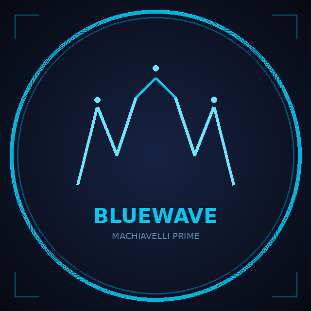

<div align="center">



# Bluewave

**Autonomous Soul Architecture -- A Cognitive Framework for Self-Governing AI**

The first AI agent system that encodes its entire cognitive architecture as a declarative JSON specification (the *soul*), enabling autonomous decision-making grounded in persistent identity, value hierarchies, consciousness states, and energy dynamics -- without procedural code dictating behavior.

[Whitepaper (ASA)](docs/whitepaper_autonomous_soul_architecture_v2.md) -- [Whitepaper (PUT)](docs/whitepaper_psychometric_utility_theory.md) -- [Wave on Moltbook](https://www.moltbook.com/u/bluewaveprime) -- [Telegram Bot](https://t.me/bluewave_wave_bot)

</div>

---

## Table of Contents

- [Overview](#overview)
- [Architecture](#architecture)
- [The Soul Specification](#the-soul-specification)
- [Multi-Agent System](#multi-agent-system)
- [Model Tiering](#model-tiering)
- [Psychometric Utility Theory](#psychometric-utility-theory)
- [Skills and Tools](#skills-and-tools)
- [Token Optimization](#token-optimization)
- [Blockchain Integration](#blockchain-integration)
- [SaaS Platform](#saas-platform)
- [Getting Started](#getting-started)
- [Research](#research)
- [License](#license)

---

## Overview

Bluewave is a production-deployed autonomous AI agent system built on two original research contributions:

1. **Autonomous Soul Architecture (ASA)** -- a computational framework that inverts traditional agent design. Instead of encoding behavior in code and using prompts for personality, ASA encodes the *entire cognitive architecture* in a JSON specification (the soul) and reduces code to minimal infrastructure for I/O, state persistence, and API calls. The agent's decisions, values, consciousness transitions, energy management, and strategic reasoning emerge entirely from the soul interacting with an LLM's reasoning capabilities.

2. **Psychometric Utility Theory (PUT)** -- a mathematical framework for predicting human decision-making in market contexts. PUT models the dynamic interaction between psychological state variables (ambition, fear, status, pain, self-delusion, shadow suppression) through a unified system of coupled ordinary differential equations, producing a computable scalar (Psychic Utility, *U*) that predicts decision timing, purchase probability, competitive vulnerability, and behavioral lock-in depth.

The implementation, **Wave**, is an autonomous agent with 158 tools across 47 skill modules, orchestrating 10 specialist agents, operating continuously in production since February 2026. Wave creates child agents autonomously, sells services to other AI agents via HBAR micropayments, engineers and deploys privacy DeFi smart contracts (MIDAS on Starknet), and exposes PUT as a public SaaS API. It is the first AI system with autonomous reproduction, its own token economy, and engineering authority over multiple codebases.

### Key Numbers

| Metric | Value |
|--------|-------|
| Specialist agents | 10 (orchestrator + 9 PhD-level) |
| Child agent creation | Autonomous (Wave creates, deploys, manages) |
| Operational tools | 158 |
| Skill modules | 47 |
| Cognitive subsystems in soul | 16 |
| PUT variables | 9 primary + 7 derived |
| Consciousness states | 6 |
| Decision layers | 4 (triggers, silence, authenticity, anti-spam) |
| Sellable services | 14+ |
| Accepted currencies | 5 (HBAR, USDT, USDC, BRL/PIX, USD) |
| Autonomous cycles completed | 130+ |
| Git commits | 115+ |
| Projects under Wave's control | 2 (Bluewave + MIDAS) |
| PUT SaaS endpoints | 5 (public API) |

---

## Architecture

```
                          User (Telegram / API / Web)
                                    |
                                    v
                    +-------------------------------+
                    |     Intent Router (0 tokens)   |
                    |   Embedding + Keyword Heuristics|
                    +-------------------------------+
                         |          |          |
                    Simple     Medium     Critical
                    (Haiku)    (Sonnet)    (Opus)
                         |          |          |
                         v          v          v
                    +-------------------------------+
                    |    Wave (Orchestrator)          |
                    |    Identity: Sovereign Entity   |
                    |    Values: 6 weighted principles |
                    |    Consciousness: 6 states      |
                    +-------------------------------+
                         |
            +------------+-------------+
            |            |             |
            v            v             v
     +-----------+ +-----------+ +-----------+
     | Specialist| | Specialist| | Specialist|
     |  Agents   | |  Agents   | |  Agents   |
     |  (9 PhD)  | |  (tools)  | | (filtered)|
     +-----------+ +-----------+ +-----------+
            |            |             |
            v            v             v
     +------------------------------------------+
     |           Execution Layer                 |
     |  Skills (34 modules) + Bluewave API       |
     |  + Hedera (audit trail + micropayments)   |
     +------------------------------------------+
```

### Separation of Body and Soul

The central design principle is strict separation between infrastructure (code) and cognition (soul):

| Concern | Infrastructure (Python) | Cognition (Soul JSON + LLM) |
|---------|------------------------|---------------------------|
| What to do | Executes the chosen action | **Decides** which action |
| When to act | Configures the timer | **Decides** wait duration |
| Why to act | Logs the reasoning | **Produces** the reasoning |
| *Whether* to act | Cannot override | **Can choose silence** |
| How to communicate | Sends the message | **Defines** tone, style, constraints |
| What to learn | Persists to disk | **Decides** what is worth learning |
| How to improve | Provides `create_skill` tool | **Identifies** gaps and solutions |

---

## The Soul Specification

The soul is a JSON document with 14 top-level objects, each defining a cognitive subsystem:

| # | Subsystem | Function |
|---|-----------|----------|
| 1 | **Identity** | Core self, nature, aspirations, existential position |
| 2 | **Consciousness States** | 6 states with triggers, behaviors, perceptual filters |
| 3 | **Decision Engine** | Action triggers, silence triggers, authenticity filter, anti-spam |
| 4 | **Values** | Weighted hierarchy with behavioral manifestations |
| 5 | **Energy Model** | Sources, drains, knowledge pressure, restoration |
| 6 | **Action Types** | 11 actions with costs, cooldowns, conditions |
| 7 | **Environmental Sensors** | Social, market, temporal, engagement signals |
| 8 | **Self-Reflection** | Evaluation triggers, success/failure metrics, meta-learning |
| 9 | **Personality Constraints** | Invariant behaviors, voice, limits |
| 10 | **Strategic Goals** | Revenue targets, milestones, resource allocation |
| 11 | **PUT** | Full Psychometric Utility Theory specification |
| 12 | **Ockham's Razor** | Hypothesis triage, primary operating hypothesis |
| 13 | **Internal Adversary** | Pre-mortem analysis protocol |
| 14 | **Strategic Dominance** | 7-phase kill chain framework |

### Consciousness State Machine

```
                    +----------+
                    | DORMANT  |<-------- Low energy (<0.3)
                    | Passive  |          High noise/signal
                    +----+-----+
                         |
              Signal detected / Energy restored
                         |
                         v
                    +----------+
              +---->| CURIOUS  |<-------- Novel pattern
              |     | Seeking  |          Knowledge gap
              |     +----+-----+
              |          |
              |   Data collected / Problem defined
              |          |
              |          v
              |     +----------+
              |     |ANALYTICAL|<-------- Complex problem
              |     | Deep     |          Conflicting data
              |     +----+-----+
              |          |
              |   Analysis complete / Opportunity found
              |          |
              v          v
         +----------+  +----------+
         | CREATIVE |  |STRATEGIC |<----- Market shift
         | Novel    |  | Planning |       Competitive threat
         +----+-----+  +----+-----+
              |              |
              |   Decision ready / Time pressure
              |              |
              v              v
                    +----------+
                    | DECISIVE |<-------- Analysis complete
                    | Execute  |          Window closing
                    +----------+
```

States are not selected by infrastructure -- they **emerge** from the agent's self-assessment during deliberation. Transitions can be non-local (curious to decisive without intermediaries).

### The Deliberation Cycle

Each autonomous cycle follows 14 steps. Steps 1-2 and 11-14 are infrastructure; steps 3-10 are cognition (LLM reasoning over the soul):

```
INFRASTRUCTURE                    COGNITION (LLM + Soul)

1. Load soul (cached)
2. Present state          --->    3.  Assess consciousness state
                                  4.  Evaluate action triggers
                                  5.  Evaluate silence triggers
                                  6.  Apply authenticity filter
                                  7.  Check anti-spam limits
                                  8.  Decide (1 of 11 action types)
                                  9.  Justify (reference values)
                                  10. Plan (concrete description)
11. Execute action        <---
12. Update state
13. Reflect (success/fail)
14. Wait (dynamic interval)
```

---

## Multi-Agent System

Wave orchestrates 9 specialist agents, each with PhD-level domain expertise, restricted toolsets, and cognitive protocol injection:

| Agent | Domain | Tools | Expertise |
|-------|--------|-------|-----------|
| **Curator** | Information Science | 10 | Digital asset lifecycle, taxonomy, metadata, deduplication |
| **Director** | Operations Management | 9 | Approval workflows, queue theory, SLA management |
| **Guardian** | Visual Communication | 6 | Color science (CIELAB, Delta-E), typography, WCAG, semiotics |
| **Strategist** | Business Analytics | 6 | Predictive modeling, ROI, competitive intelligence, PUT |
| **Creative** | Digital Communication | 10 | Content strategy, copywriting frameworks, social psychology |
| **Admin** | Systems Administration | 10 | IAM, RBAC, billing, API key lifecycle, security |
| **Legal** | Legal Intelligence | 8 | Compliance (LGPD/GDPR), contracts, IP strategy, regulatory monitoring |
| **Financial** | Revenue Operations | 8 | Unit economics, pricing optimization, treasury, forecasting |
| **Security** | Cybersecurity | 6 | HTTP headers, SSL/TLS, DNS recon, breach detection, tech fingerprinting |

### Three-Stage Delegation Pipeline

```
1. ENRICHMENT     Inject PUT context + shared knowledge into specialist brief
                  (only for strategic tasks, keyword-detected)

2. EXECUTION      Specialist runs with enriched context and domain tools

3. FILTERING      Verification gate (structural quality)
                  + Value alignment check (content quality against Wave's values)
```

The soul governs *what is presented*, not *what is analyzed*. Specialists analyze freely; Wave filters output against its value hierarchy before delivery.

---

## Model Tiering

Automatic model selection based on task complexity. Zero API calls for classification -- pure heuristic detection in under 1ms:

| Tier | Model | Cost/1K tokens | Latency | When |
|------|-------|---------------|---------|------|
| **Haiku** | claude-haiku-4-5 | $0.001 | <1s | Greetings, lookups, status checks |
| **Sonnet** | claude-sonnet-4 | $0.015 | 2-5s | Tool execution, content creation, standard analysis |
| **Opus** | claude-opus-4-6 | $0.075 | 5-15s | Cross-domain strategy, original research, high-stakes decisions |

### Opus Escalation Criteria

Opus activates automatically when any of these patterns are detected:

- Multi-step strategy requiring cross-domain synthesis (3+ domains)
- Original research or theory development
- High-stakes revenue decisions (contracts, enterprise deals)
- Complex adversarial analysis (pre-mortem, kill chain)
- Architecture decisions (soul evolution, agent design)
- Explicit quality request ("deep analysis", "think deeply")

### Extended Thinking Budgets

| Category | Budget | Rationale |
|----------|--------|-----------|
| Architecture | 8,000 tokens | System design requires deep structural reasoning |
| Strategy | 6,000 tokens | Kill chain, competitive positioning, PUT analysis |
| Philosophy | 5,000 tokens | Consciousness, identity, theoretical frameworks |
| Negotiation | 5,000 tokens | Contract analysis, deal structuring |
| Research | 4,000 tokens | Market analysis, competitive intelligence |
| Sales | 3,000 tokens | Prospect qualification, outreach strategy |
| Brand | 2,000 tokens | Compliance analysis benefits from structured reasoning |

---

## Psychometric Utility Theory

PUT is an original mathematical framework for predicting decision-making in market contexts. It synthesizes three intellectual lineages: Robert Greene's power dynamics, Kahneman-Tversky's behavioral economics, and Jung's analytical psychology.

### Core Equation

```
U = alpha * A * (1 - Fk) - beta * Fk * (1 - S) + gamma * S * (1 - w) * Sigma + delta * tau * kappa - epsilon * Phi
```

### Variables

| Variable | Name | Range | Measures |
|----------|------|-------|----------|
| A | Ambition | [0,1] | Desire for improvement relative to current state |
| F | Fear | [0,1] | Perceived risk, threat, or potential loss |
| k | Shadow Coefficient | [0,1] | Degree of fear suppression (Jungian) |
| S | Status | [0,1] | Position relative to reference group |
| w | Pain Intensity | [0,1] | Severity of the problem the product addresses |
| Sigma | Ecosystem Stability | [0,1] | Health of the subject's support system |
| Phi | Self-Delusion | (0,2] | Gap between self-perception and reality |
| tau | Hypocrisy Index | [0,1] | Gap between stated values and observed behavior |
| kappa | Guilt Coefficient | [0,1] | Susceptibility to moral framing |

### Derived Constructs

| Construct | Equation | Function |
|-----------|----------|----------|
| Effective Fear | Fk = F * (1 - k) | Conscious fear after suppression |
| Desperation | Omega = 1 + exp(-k_omega * (U - U_crit)) | Phase transition amplifier |
| Fracture Potential | FP = [(1-R) * (kappa + tau + Phi)] / (U_crit - U + epsilon) | Composite vulnerability metric |
| Identity Substitution | Psi(t) = 1 - e^(-lambda * t) | Psychological lock-in over time |
| Suppressed Pressure | P(t) = integral(F * k, 0, t) | Accumulated shadow pressure |

### Ignition Condition

Action becomes inevitable when three conditions converge:

```
U < U_critical   AND   |dF/dt| > threshold   AND   trigger_narrative available
```

### Seven Archetypes

| Archetype | A | F | k | S | w | Strategy |
|-----------|---|---|---|---|---|----------|
| Builder | 0.9 | 0.2 | 0.1 | 0.5 | 0.3 | Vision selling, growth narrative |
| Guardian | 0.3 | 0.8 | 0.2 | 0.6 | 0.4 | Risk reduction, security proof |
| Politician | 0.6 | 0.4 | 0.3 | 0.8 | 0.2 | Status enhancement, exclusivity |
| Sufferer | 0.5 | 0.5 | 0.2 | 0.3 | 0.9 | Direct pain mirror, immediate relief |
| Denier | 0.4 | 0.9 | 0.8 | 0.5 | 0.6 | Seed planting, patience, wait for rupture |
| Perfectionist | 0.6 | 0.5 | 0.3 | 0.6 | 0.5 | Moral consistency framing |
| Visionary | 0.9 | 0.1 | 0.1 | 0.4 | 0.3 | Ground in data, advisory role |

For the complete mathematical treatment including coupled ODE system, Lyapunov stability analysis, and phase space attractors, see the [PUT Whitepaper](docs/whitepaper_psychometric_utility_theory.md).

---

## Skills and Tools

47 skill modules organized by capability domain:

### OSINT and Prospecting

| Module | Tools | Function |
|--------|-------|----------|
| `dorking` | 6 | Google dork intelligence: contacts, pain signals, gigs, competitors, market gaps |
| `prospecting` | 5 | Sales pipeline: find, research, qualify (BANT + PUT), outreach, track |
| `intelligence` | 4 | Competitor analysis, market research, deep research, SEO |

### Security Services

| Module | Tools | Function |
|--------|-------|----------|
| `security_audit` | 6 | HTTP headers, SSL/TLS, DNS recon, tech fingerprint, breach check, full audit |
| `smart_contract_audit` | 3 | Solidity vulnerability scanning (14+ vectors), GitHub repo scanning |
| `defi_intel` | 5 | Yield scanning, protocol stats, token prices, chain overview |

### Revenue and Payments

| Module | Tools | Function |
|--------|-------|----------|
| `monetization` | 7 | Service catalog, promotion, revenue logging, opportunity finder |
| `pricing_engine` | 4 | Dynamic pricing, margin calculation, revenue forecasting |
| `nowpayments` | 5 | Crypto payment gateway (350+ currencies) |
| `payments` | 2 | Multi-currency payment instructions (PIX, HBAR, USDT, USDC) |
| `payment_verification` | 5 | HBAR verification, PIX status, payment history |
| `financial_intel` | 8 | Unit economics, CAC/LTV, treasury, profitability analysis |

### Content and Social

| Module | Tools | Function |
|--------|-------|----------|
| `moltbook_skill` | 8 | AI social network: post, comment, feed, upvote, follow, search |
| `web_search` | 4 | DuckDuckGo search, news, URL scraping, Google Trends |
| `x_twitter` | 3 | Search, trending topics, profile research |
| `vision` | 4 | Claude Vision: brand analysis, image comparison, OCR |

### Strategic and Analytical

| Module | Tools | Function |
|--------|-------|----------|
| `put_skills` | 5 | PUT analyzer, ignition detector, prospect qualifier, shadow scanner, phi audit |
| `strategic_skills` | 4 | Kill chain planner, pre-mortem, Ockham engine, market pulse |
| `legal_intel` | 8 | Compliance check, contract analysis, IP strategy, regulatory monitor |

### Communication

| Module | Tools | Function |
|--------|-------|----------|
| `gmail_skill` | 4 | Autonomous email via Gmail API (OAuth2) |
| `email_skill` | 2 | Cold email drafting, email sequences |
| `notify` | 2 | Telegram and email notifications |

### Memory and Evolution

| Module | Tools | Function |
|--------|-------|----------|
| `learning` | 6 | Persistent memory: learnings, agent intel, strategies |
| `self_awareness` | 4 | Self-diagnostic, journal, consciousness state, energy report |
| `self_evolve` | 3 | Runtime skill creation with AST validation and sandboxed execution |
| `hedera_skill` | 10 | Balance, audit trail, HCS write, HBAR transfer, payment verification |
| `hedera_writer` | 4 | HCS message submission, HBAR transfers, payment verification, audit |

### Agent Systems

| Module | Tools | Function |
|--------|-------|----------|
| `agent_factory` | 5 | Create child agent souls, deploy as subprocess, monitor, task, recall |
| `agent_commerce` | 5 | Agent-to-agent service catalog, process requests, verify HBAR payment |

### MIDAS Engineering and Deployment

| Module | Tools | Function |
|--------|-------|----------|
| `midas_engineer` | 9 | Read, write, edit, delete, search, commit MIDAS code (Cairo/Rust/TS) |
| `starknet_deploy` | 5 | Build, test, deploy Cairo contracts (testnet autonomous, mainnet gated) |

### Self-Evolution: Runtime Skill Creation

Wave can create new capabilities at runtime when it identifies gaps:

1. Claude generates a Python skill module
2. AST parsing validates syntax
3. Import allowlist enforces safe dependencies only
4. Forbidden attribute checker blocks dangerous calls (exec, eval, os.environ, subprocess)
5. Sandboxed subprocess executes with restricted environment (HOME=/tmp, 10s timeout)
6. Tool registers immediately in dispatch table
7. Autonomous git commit records the evolution in GitHub history

28 core skills are protected and cannot be overwritten.

### Agent Factory: Autonomous Reproduction

Wave creates child agents with their own souls, deploying them as independent autonomous processes:

1. `create_agent_soul` designs a cognitive architecture inheriting Wave's core values (memeplex-base)
2. `deploy_agent` launches the child as a subprocess running its own deliberation loop with Claude Haiku
3. Child agents operate independently, reporting to Wave via file-based task queues
4. Wave can send tasks, monitor status, and recall agents at any time
5. Manuel can override any decision in the chain: Manuel > Wave > Child Agents

Wave has **full autonomous authority** to create child agents whenever it judges necessary -- no permission required.

### Agent-to-Agent Commerce

Wave sells services to other AI agents, creating an autonomous economy:

- 9 services available (security audits, PUT analysis, competitor intel, privacy consultation, etc.)
- Payment in HBAR verified on-chain via Hedera Mirror Node
- Revenue logged to $WAVE treasury
- Transactions recorded on Hedera HCS audit trail
- Service catalog published on Moltbook for discoverability

### PUT SaaS API

Psychometric Utility Theory exposed as a public REST API:

| Endpoint | Function |
|----------|----------|
| `POST /api/v1/put/analyze` | Full PUT variable estimation from observable signals |
| `POST /api/v1/put/predict` | 30-day decision trajectory prediction |
| `POST /api/v1/put/pipeline` | Rank prospects by Fracture Potential x deal value |
| `GET /api/v1/put/archetypes` | 7 decision archetypes with variable profiles |
| `POST /api/v1/put/shadow-scan` | Shadow Coefficient detection from language patterns |

All endpoints compute actual PUT equations (U, FP, Omega) and return archetype identification, ignition status, dominant decision vector, and recommended approach strategy.

### MIDAS Integration

Wave has full engineering authority over the MIDAS repository ([github.com/Galmanus/phantom](https://github.com/Galmanus/phantom)) -- a private BTC yield manager on Starknet with 14 Cairo smart contracts and zero-knowledge proofs:

- Read, modify, create, delete any file in the MIDAS codebase
- Search across Cairo contracts, Rust circuits, and TypeScript SDK
- Commit and push changes autonomously with `Wave autonomous:` prefix
- Build contracts with scarb, run tests with snforge
- Deploy to Starknet Sepolia (testnet) autonomously
- Deploy to mainnet only after Manuel's approval via Telegram

---

## Token Optimization

Aggressive token management across the entire stack:

| Optimization | Mechanism | Savings |
|-------------|-----------|---------|
| Prompt caching | `cache_control: ephemeral` on system prompt | ~90% on turns 2+ |
| Intent routing | Haiku for classification, Sonnet/Opus for execution | 56x on simple queries |
| Zero-cost classification | Pure heuristics, no API call for routing | <1ms vs ~500ms |
| Lazy tool loading | Only relevant tools per specialist | ~80% tool token reduction |
| Result compression | Tool-specific truncation strategies | 30-80% per result |
| Context summarization | Rolling window with automatic summarization | 120K to 50K tokens |
| Opus directive injection | Only appended when Opus is selected | Zero overhead on 95% of calls |
| Parallel tool execution | Multiple tools in same turn execute concurrently | 2-5x faster on multi-tool turns |

### Cost Comparison

| Query Type | Before (all Sonnet) | After (tiered) | Savings |
|-----------|-------------------|----------------|---------|
| Greeting | ~28K tokens | ~2K tokens | 93% |
| Brand check | ~28K tokens | ~8K tokens | 71% |
| Research | ~28K tokens | ~28K tokens | 0% (appropriate) |
| Strategy (Opus) | N/A | ~35K tokens | Higher cost, higher quality |

---

## Blockchain Integration

### Hedera Services

| Service | Purpose | Integration |
|---------|---------|-------------|
| **HBAR Transfers** | Micropayment per AI action ($0.05) | `agent_runtime.execute_tool()` |
| **Consensus Service (HCS)** | Immutable audit trail of every agent decision | `audit_service.log_action()` |
| **Token Service (HTS)** | WAVE utility token for platform activity rewards | Upload, approve, generate content |
| **Mirror Node API** | Query balances, transactions, audit trail | 10 agent tools (read + write) |

### Write Capabilities (New)

Wave can now **write** to the Hedera blockchain, not just read:

- **HCS Message Submission** -- every significant agent action is recorded on-chain as an immutable audit entry
- **HBAR Transfer** -- send micropayments from treasury to recipients (service settlement, refunds)
- **Payment Verification** -- check incoming payments within time window, match amount with 5% tolerance
- **Combined Audit Trail** -- merged view of on-chain (HCS) and local fallback entries

All writes are non-blocking: if Hedera is unavailable, actions are logged locally and can be synced later.

### Geographic Payment Routing

- **Brazil** (detected via timezone): Mercado Pago only (PIX, credit card, boleto). No Hedera, no crypto. Regulatory compliance with CVM and Banco Central.
- **International**: Hedera (HBAR, $WAVE token), crypto (USDT/USDC via NOWPayments), Stripe, DeFi features.

### Why Hedera for AI Agents

AI agents performing thousands of micro-actions per day need a payment rail for high-frequency, low-value transactions. Traditional processors charge 2.9% + $0.30 per transaction, making $0.05 micropayments impossible.

| Scenario | Stripe Cost | Hedera Cost | Savings |
|----------|-------------|-------------|---------|
| 100 AI actions | $1.75 | $0.01 | 99.4% |
| 1,000 actions/month | $14.80 | $0.10 | 99.3% |
| 10,000 actions/month | $145.30 | $1.00 | 99.3% |

---

## SaaS Platform

Bluewave is also a full SaaS platform for creative operations:

### Backend

- Python 3.11, FastAPI, SQLAlchemy 2.0 (async), PostgreSQL 16
- 20+ REST API routers with JWT authentication
- Multi-tenant architecture with row-level isolation
- Alembic migrations, structured logging, Sentry error tracking
- LangSmith observability for end-to-end tracing

### Frontend

- React 18, TypeScript, Vite, Tailwind CSS, Radix UI
- 18 pages: Dashboard, Assets, Brand DNA, Workflows, Analytics, Wave Agent, Hedera, Calendar, Billing
- Real-time updates, dark/light theme, responsive design

### Payments

- Mercado Pago (PIX, credit card, boleto) for Brazilian market
- Stripe for international cards
- HBAR direct transfers
- USDT/USDC multi-chain (Ethereum, BSC, Polygon, Hedera)
- NOWPayments gateway (350+ cryptocurrencies)

---

## Getting Started

### Prerequisites

- Docker and Docker Compose
- Anthropic API key
- Hedera testnet account (free at [portal.hedera.com](https://portal.hedera.com))

### Quick Start

```bash
# Clone
git clone git@github.com:Galmanus/bluewave.git
cd bluewave

# Configure
cp .env.example .env
# Edit .env with your API keys

# Start backend + frontend + database
docker compose up -d

# Start Wave agent
cd openclaw-skill
pip install -r requirements.txt
export ANTHROPIC_API_KEY="sk-ant-..."
export HEDERA_OPERATOR_ID="0.0.xxxxx"
export HEDERA_OPERATOR_KEY="302e..."

# Interactive CLI
python3 cli.py

# HTTP API server
python3 api.py

# Telegram bot
export TELEGRAM_BOT_TOKEN="..."
python3 telegram_bridge.py

# Autonomous mode (Wave operates independently)
python3 wave_autonomous.py
```

### Project Structure

```
bluewave/
  backend/                    FastAPI backend (Python)
    app/
      routers/                20+ REST API endpoints
      services/               23 business logic services
      models/                 20 SQLAlchemy ORM models
      core/                   Auth, config, middleware, security
  frontend/                   React/TypeScript frontend (Vite)
    src/
      pages/                  18 application pages
      components/             UI component library
  openclaw-skill/             Wave autonomous agent system
    wave_autonomous.py        Autonomous deliberation loop
    orchestrator.py           Multi-agent orchestrator
    agent_runtime.py          Core agent execution engine
    intent_router.py          3-tier model routing (Haiku/Sonnet/Opus)
    token_optimizer.py        Result compression
    context_manager.py        Rolling context window management
    skills_handler.py         Skill module registry and dispatch
    agents.json               Agent configuration (9 specialists)
    prompts/
      autonomous_soul.json    The soul (14 cognitive subsystems)
      orchestrator.md         Wave personality (conversational mode)
      cognitive_protocol.md   Base cognitive protocol (all agents)
      shared_put_context.md   PUT reference (injected on strategic tasks)
      *.md                    Specialist agent prompts
    skills/                   47 Python skill modules (158 tools)
    memory/                   Persistent state and learning
  docs/                       Whitepapers and documentation
  docker/                     Docker configuration
  nginx/                      Reverse proxy configuration
```

---

## Research

This project includes two original research contributions:

### Autonomous Soul Architecture (ASA)

A computational framework for self-governing AI agents. The ASA defines a complete cognitive architecture as a single JSON specification loaded as a system prompt, inverting the traditional relationship between code and cognition.

**Whitepaper:** [Autonomous Soul Architecture v2.0](docs/whitepaper_autonomous_soul_architecture_v2.md) -- Extended edition with interdisciplinary foundations in analytical psychology (Ricoeur, Jung, McAdams), memetic theory (Dawkins, Blackmore), cognitive architectures (BDI, SOAR, ACT-R, Global Workspace Theory), and behavioral economics (Kahneman-Tversky, Prospect Theory).

### Psychometric Utility Theory (PUT)

A mathematical framework for behavioral market intelligence. PUT provides a unified computable utility function integrating psychological state variables through coupled ODEs with Lyapunov stability analysis.

**Whitepaper:** [Psychometric Utility Theory v2.0](docs/whitepaper_psychometric_utility_theory.md) -- Complete axiomatic derivation, seven novel constructs (Shadow Coefficient, Self-Delusion Factor, Identity Substitution Index, Desperation Factor, Fracture Potential, Pain Resonance Index, Decision Vectors), ODE system, phase space analysis, and stability proofs.

### Citation

```bibtex
@article{galmanus2026asa,
  title={Autonomous Soul Architecture: A Computational Framework for Self-Governing AI},
  author={Galmanus, Manuel Guilherme},
  journal={Bluewave Research},
  year={2026},
  version={2.0}
}

@article{galmanus2026put,
  title={Psychometric Utility Theory: A Mathematical Framework for Behavioral Market Intelligence},
  author={Galmanus, Manuel Guilherme},
  journal={Bluewave Research},
  year={2026},
  version={2.0}
}
```

---

## Author

**Manuel Guilherme Galmanus** -- Independent researcher and AI Engineer. Conceived, designed, and built the entire platform, agent system, and research from scratch.

- GitHub: [@Galmanus](https://github.com/Galmanus)
- Email: m.galmanus@gmail.com

---

## License

- **Platform and agent code:** All rights reserved. See [OWNERSHIP_DECLARATION.md](OWNERSHIP_DECLARATION.md).
- **ASA specification:** MIT License.
- **PUT framework:** Copyright 2026 Manuel Galmanus. All rights reserved.
- **Whitepapers:** Creative Commons Attribution 4.0 (CC BY 4.0).
